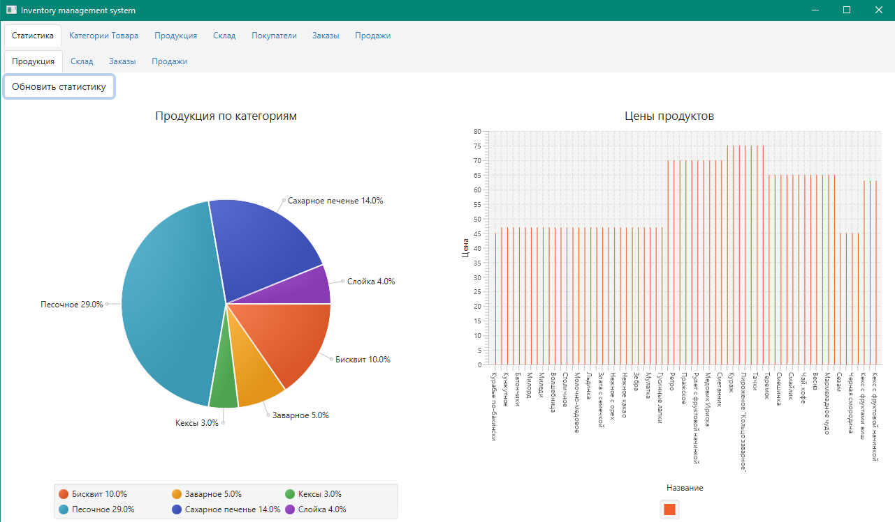
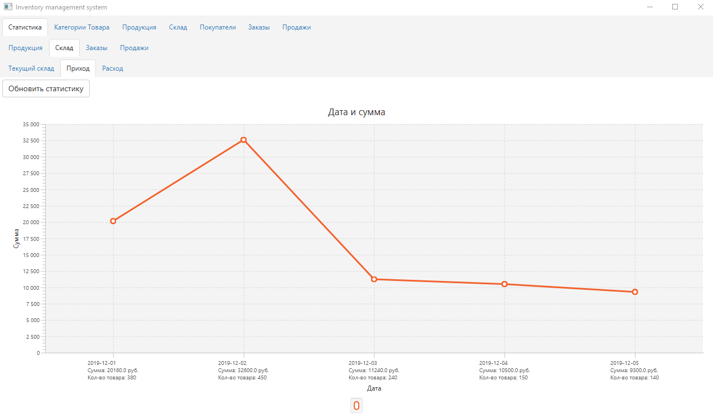

## Inventory Management System

#### This uses following libraries/frameworks
   - OpenJDK 11
   - JavaFX 11
   - Hibernate

#### Requirements:
   - Java
   - MySQL Server
 
#### How to set up a database  
   - Download MySQL dump files - [download files](https://github.com/leodeg/Java.InventoryManagementSystem/releases/download/0.1-alpha/MySQL_Dump_For_Application.rar)
   - Create a scheme in the local database with a name "inventory_management_system"
   - Import the dump files to the scheme
   - For the server as the login and the password used "root" 
   - Or change the connection configurations in the "persistence.xml" file
     
#### How to run the application
##### From the IDE
  - Clone/Download the project and import into IDE - [download](https://github.com/leodeg/Java.InventoryManagementSystem/archive/master.zip)
  - Run MySQL server
  - Run com.main.Main as Java Application
##### Using jar
  - Download the project jar archive - [download](https://github.com/leodeg/Java.InventoryManagementSystem/releases/download/0.1-alpha/InventoryManagementSystem_jar.rar)
  - Run MySQL server
  - Run "run_project.cmd" from the downloaded archive
   

